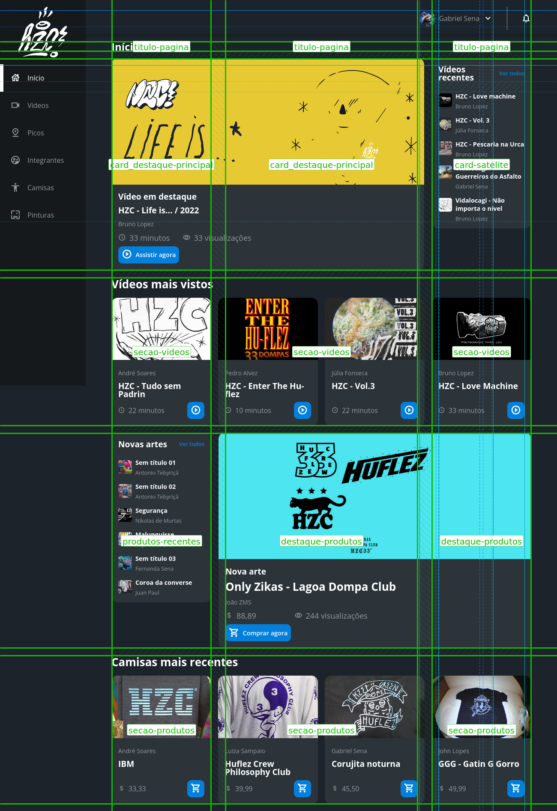

# hzc_flexbox-grid

## Arranging elements with Flexbox and Grid.
<li> Flex container is the element that receives most of the positioning properties for its child tags;
<li> Justify-content distributes the remaining space of the flex container among its child tags and 
align-items vertically aligns the child tags, that is, they are horizontal and vertical positioning properties respectively;
<li> Flex-wrap is the property we use when there is no more space to wrap all elements horizontally/vertically and a “line wrap”
is needed to maintain the proportion of the elements;
<li> Naturally, the orientation of the flex container is horizontal and to change its axis, just use the flex-direction property;
<li> The justify-content and align-items positioning properties move all flex items, if we need an individual positioning, 
we use the -self properties on specific flex items;
<li> There are several situations in which the flex property can be used. It is even an incentive to use flex 
instead of changing the display to inline/inline-block;
<li> The limitations of working with flexbox: the main one is to work with two axes at the same time, vertical and horizontal axis;
<li> The basic functioning of the grid: the idea of a grid container is very similar to a flex container, but in the grid container 
the flow is vertical and we also gain access to other properties;
<li> Properties for creating rows and columns - grid-template-rows and grid-template-columns: the values these properties take are 
the column/row sizes. Ex: for 3 columns of 30px the property is written: grid-template-columns: 30px 30px 30px;
<li> New unit of measure fr : it is the unit of measure for working with proportions in a simpler way than percentage. Especially 
when the percentage is a recurring decimal.
<li> Merge rows and columns with  propertie grid-columns and grid-rows: span n: it is the concept of “cell blending”. 
It is used to say how many columns/rows an element occupies within the grid container;
<li> The column-gap, row-gap and gap properties: these are the properties that give spacing between grid items;
<li> How to use auto value for column size: we don't always want to put a fixed value for the columns/rows. 
The value auto allows them to adapt according to the content;
<li> Plan the use of grid in development: A very interesting technique is to use some drawing tool and sketch possible lines and 
columns on top of the received layout;
<li> How to evolve the layout for desktop with grid: how to plan and create page columns and rows when there is more horizontal 
space on a desktop device;
<li> The repeat() function: when we need to create many columns with the same size, avoiding code repetition;
<li> Change the position of elements with the grid-row and grid-column properties: previously only used to merge rows and columns,
we've seen that these properties also control where an element starts and ends within the grid container;
<li> The advantages and use of grid areas: grid areas comes with the purpose of facilitating code maintenance and visibility 
of elements within the grid container.

